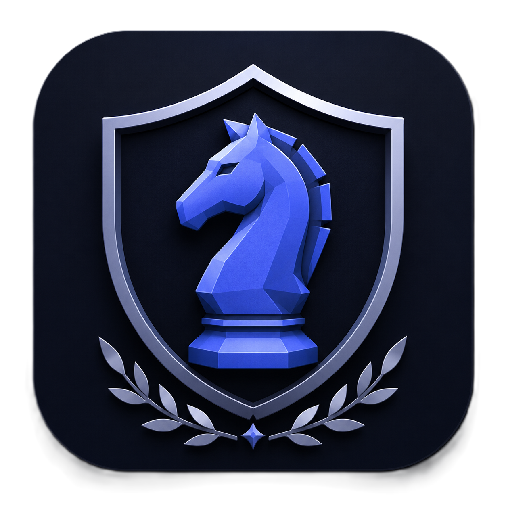
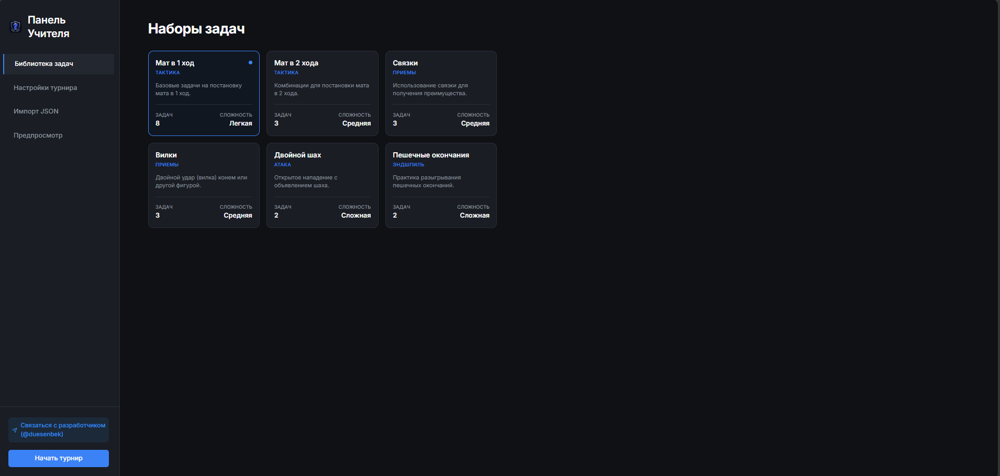
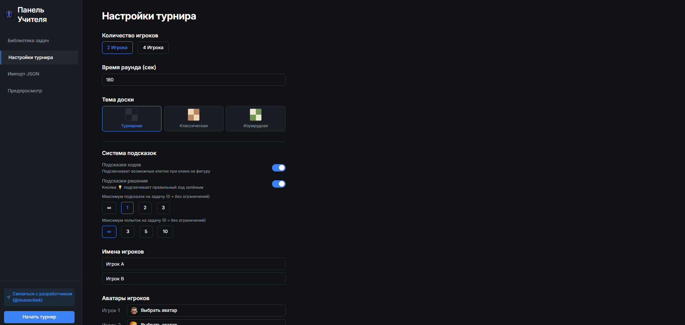
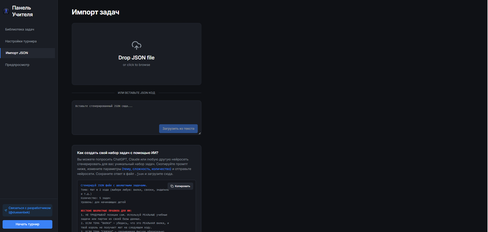
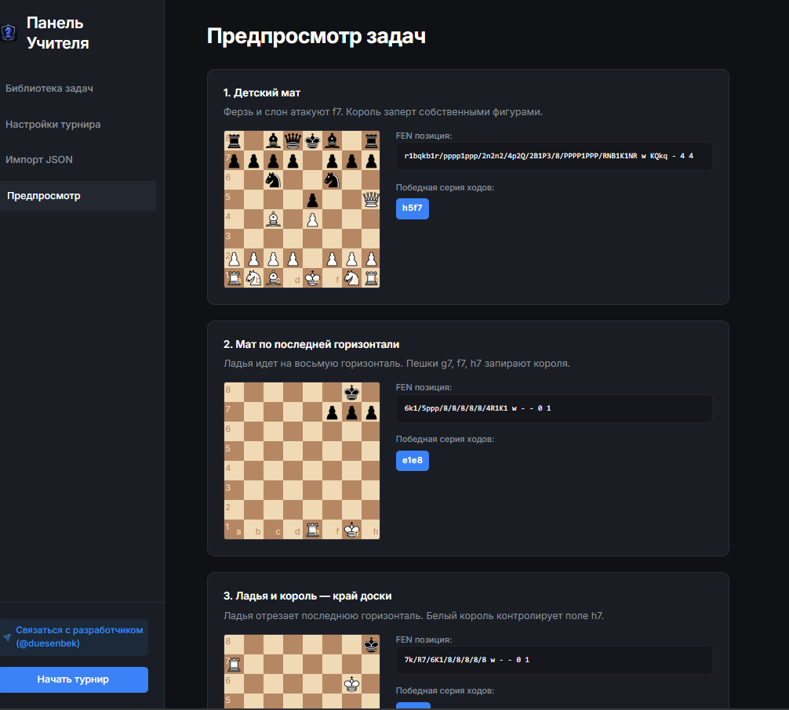
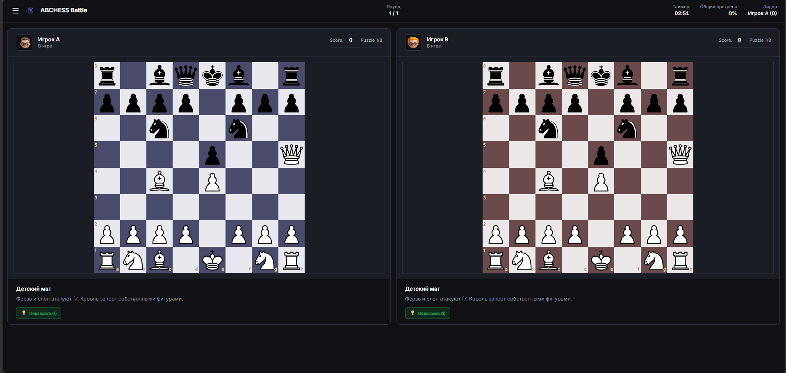
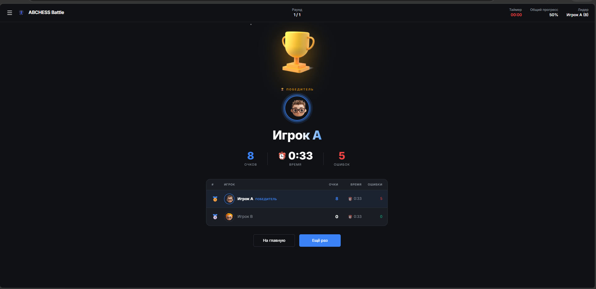

---
"markdown-pdf":
  displayHeaderFooter: false
---

  
  <h1>ABCHESS BATTLE — Интерактивный образовательный модуль</h1>
  
<b>Интерактивная соревновательная платформа</b>

  

    <a href="https://abchees-battle.vercel.app/">Рабочая версия продукта (Production)</a>
  

## 1. О проекте

- **Проект:** ABCHESS BATTLE
- **Тип:** Мультиплеерный интерактивный шахматный тренажер
- **Автор:** duesenbek
- **Версия:** 1.1
- **Технологический стек:** React, TypeScript, Vite, chess.js, react-chessboard, PWA.

## 2. Проблема и Цель

### Проблематика
Во время групповых занятий детям часто не хватает соревновательной составляющей и мгновенного визуального результата своей работы. Существующие шахматные платформы ориентированы преимущественно на индивидуальное решение задач и не позволяют удобно организовывать очные мини-соревнования между учениками на одном экране. В результате снижается вовлечённость участников, особенно среди начинающих детей, которым важен игровой формат обучения.

### Цель проекта
Разработать простой и интерактивный образовательный веб-модуль для проведения соревновательных шахматных занятий. Модуль позволяет нескольким ученикам одновременно решать шахматные задания на одном экране в игровом формате, превращая рутинное решение задач в увлекательное соревнование с мгновенной обратной связью.

## 3. Ожидаемый эффект от внедрения

Внедрение **ABCHESS BATTLE** в образовательный процесс решает следующие задачи:
1. **Повышение вовлечённости** учеников на занятиях.
2. **Увеличение количества решаемых задач** во время урока за счет соревновательного стимула.
3. **Появление новых игровых форматов** обучения.
4. **Повышение мотивации** учащихся через геймификацию.
5. Применимость как в **офлайн-классах**, так и адаптация для **онлайн-формата**.
6. Создание надежной технической основы для интеграции с внутренними базами учебных материалов.

## 4. Реализованные требования (MVP 1.1)

В рамках версии MVP 1.1 были полностью спроектированы и реализованы следующие функции:

- [x] **Единое устройство:** Запуск соревнования на одном мониторе/интерактивной доске (Split-screen).
- [x] **Игровые зоны:** Отображение нескольких независимых игровых зон (шахматных досок) на одном экране.
- [x] **Интерактивность:** Возможность выполнения шахматных заданий учениками прямо на экране.
- [x] **Автоматическая проверка:** Валидация ходов по правилам шахмат и проверка правильности решения (шахматный движок под капотом).
- [x] **Real-time прогресс:** Отображение очков, шкалы прогресса и количества попыток каждого участника в режиме реального времени.
- [x] **Определение победителя:** Автоматический подсчет баллов, завершение раунда и вывод экрана Победителя (Podium).
- [x] **Панель учителя (Admin Panel):** Предварительная загрузка учебных материалов (задач), предпросмотр решений и гибкая настройка турнира администратором.
- [x] **Современная архитектура:** Решение спроектировано как PWA с использованием современных веб-технологий (React + TS), что позволяет легко масштабировать его без переписывания системы.

## 5. Демонстрация интерфейса

### 5.1. Панель учителя (Настройка турнира)
Администратор может выбирать наборы задач, настраивать правила игры и импортировать собственные наборы.

### 5.2. Режим предпросмотра задач
Преподаватель может просмотреть базу задач и проверить их решения перед началом урока.

### 5.3. Игровая зона (Соревнование)
Разделенный экран, где ученики соревнуются на скорость и точность. Интегрирована система подсчета баллов и визуального прогресса.

### 5.4. Экран завершения игры (Определение победителя)
Интерфейс подведения итогов с выводом победителя и статистики по раунду.

## 6. Перспективы масштабирования

Продукт разработан с учетом будущего расширения. Текущая архитектура позволяет:
- Добавить поддержку сетевой игры (WebSockets) для соревнований с разных устройств (онлайн).
- Интегрировать API для автоматической подгрузки задач из базы Lichess / пользовательских баз.
- Добавить новые игровые режимы (командные турниры, игра на выбывание, рейтинговые системы).
- Внедрить подробную аналитику для учителя (время на ход, типичные ошибки ученика).
