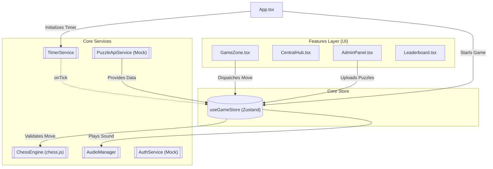

# Архитектура Проекта ABCHESS Duel

Проект использует упрощенную **Feature-based** архитектуру (похожую на Feature-Sliced Design).
Это обеспечивает высокую масштабируемость и изоляцию бизнес-логики.

## Слои (Layers)

1. **`src/core/`** — Ядро приложения. Инфраструктура, сервисы и глобальный State (Zustand). Этот слой не зависит от React-компонентов.
2. **`src/shared/`** — Переиспользуемые элементы (Theme, UI Kit).
3. **`src/features/`** — Бизнес-фичи. Каждый модуль инкапсулирует свой UI, стили и локальную логику.

## Диаграмма Потоков Данных (Data Flow)

Ниже представлена диаграмма взаимодействия UI-слоя с сервисами и стейтом.

## Подготовка к Онлайну (WebSocket)
В папке `core/services/` созданы заглушки сервисов (например, `MatchmakingService`), которые в будущем будут заменены на реальные подключения (Socket.io или native WebSockets). UI компоненты не придется переписывать, так как они взаимодействуют только со стором.
